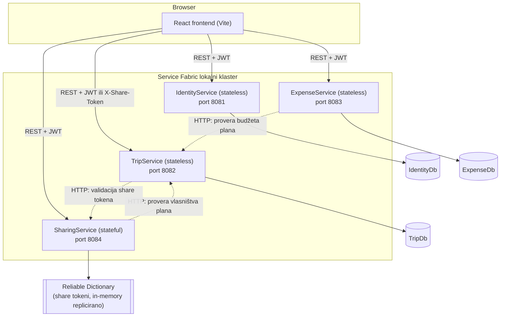

# Arhitektura sistema — Trip Planner

## Pregled

Sistem je organizovan kao **mikroservisna arhitektura** na Microsoft Service Fabric platformi, sa React frontend-om koji komunicira sa 4 nezavisna backend servisa preko REST API-ja. Svaki servis ima sopstvenu bazu podataka (database-per-service), osim `SharingService`-a koji je **stateful** i čuva podatke u Service Fabric Reliable Collections (replicirana kolekcija unutar klastera), a ne u SQL bazi.

## Servisi

| Servis | Tip | Odgovornost | Perzistencija |
|---|---|---|---|
| **IdentityService** | stateless | registracija, login, JWT izdavanje, uloge (User/Admin) | SQL Server (`IdentityDb`) |
| **TripService** | stateless | planovi putovanja, destinacije, aktivnosti/kalendar, checklist | SQL Server (`TripDb`) |
| **ExpenseService** | stateless | troškovi, kategorije, obračun preostalog budžeta | SQL Server (`ExpenseDb`) |
| **SharingService** | **stateful** | generisanje/validacija QR share tokena (VIEW/EDIT) | Service Fabric Reliable Dictionary |

## Zašto je SharingService stateful

Share tokeni su kratkotrajni, često se čitaju (svaki put kad neko otvori deljeni link ili TripService validira pristup), i ne zahtevaju kompleksne relacione upite — idealan slučaj za Service Fabric **Reliable Collections**: podaci se čuvaju u memoriji repliciranoj preko replika servisa (transakciono, uz automatski failover), bez potrebe za spoljnom bazom. Ovo demonstrira razliku između stateless servisa (koji oslanjaju perzistenciju na spoljnu bazu) i stateful servisa (koji sami upravljaju svojim stanjem uz garancije konzistentnosti platforme).

## Međuservisna komunikacija

Mikroservisi su nezavisni i ne dele bazu podataka, pa kada je jednom servisu potreban podatak iz domena drugog servisa, poziva ga direktno preko REST-a (sinhroni HTTP poziv), prosleđujući JWT token korisnika dalje:

- **ExpenseService → TripService**: pri kreiranju troška i pri obračunu preostalog budžeta, ExpenseService poziva `GET /api/trips/{id}` da dobije planirani budžet i potvrdi da plan zaista pripada korisniku.
- **SharingService → TripService**: pri kreiranju share linka, SharingService poziva `GET /api/trips/{id}` da potvrdi da korisnik koji deli plan zaista jeste njegov vlasnik.
- **TripService → SharingService**: kada neko pristupi planu preko share linka (bez JWT-a ili sa JWT-om koji nije vlasnik), TripService poziva `GET /api/sharing/validate/{token}` da proveri da li je token validan i koji nivo pristupa (VIEW/EDIT) dozvoljava.

## Autentikacija i autorizacija

- JWT (HMAC SHA256) izdaje isključivo `IdentityService`; svi ostali servisi nezavisno validiraju potpis i istek tokena istim deljenim ključem (bez ponovnog pozivanja IdentityService-a za svaki zahtev).
- Svaki servis filtrira podatke po `UserId` iz JWT claim-ova — korisnik može da vidi/menja samo svoje resurse.
- `TripPlansController` u TripService-u ima **dvostruki mod autorizacije** na `GetById`/`Update`: prihvata ili validan JWT vlasnika, ili `X-Share-Token` header validiran preko SharingService-a (VIEW dozvoljava samo pregled, EDIT dozvoljava i izmenu).
- Uloge `User`/`Admin` — Admin ima dodatni endpoint (`GET /api/identity/users`) za pregled svih korisnika.

## Frontend

React (TypeScript, Vite) aplikacija podeljena po komponentama i feature-ima (`components/`, `pages/`, `services/`, `context/`). Svi HTTP pozivi idu isključivo kroz servisni sloj (`src/services/*.ts`), nikad direktno iz komponenti. Stanje autentikacije se čuva kroz Context API (`AuthContext`), token u `localStorage`. Svi URL-ovi backend servisa čitaju se iz `.env` fajla.
