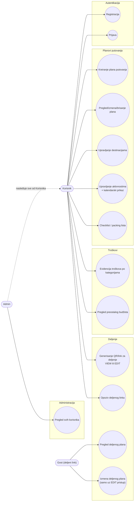

# Use Case dijagram — Trip Planner

Dva aktera: **Korisnik** (registrovan korisnik aplikacije) i **Admin** (proširuje sve mogućnosti Korisnika). Treći, neformalni akter je **Gost preko deljenog linka** — osoba bez naloga koja pristupa planu putovanja preko QR koda/linka.

## Kratak opis ključnih use case-ova

| Use case | Akter | Napomena |
|---|---|---|
| Registracija / Prijava | Korisnik | Lozinka heširana (BCrypt), JWT token po uspešnoj prijavi |
| Kreiranje/izmena/brisanje plana putovanja | Korisnik | Validacija: krajnji datum ≥ početni, budžet ≥ 0; brisanje plana briše i sve povezane entitete (cascade) |
| Upravljanje destinacijama / aktivnostima / checklist-om | Korisnik | Svaka stavka vezana za konkretan plan, vidljiva samo vlasniku |
| Evidencija troškova i pregled budžeta | Korisnik | ExpenseService poziva TripService da dobije planirani budžet i izračuna preostali |
| Generisanje/opoziv deljenog linka | Korisnik | Bira nivo pristupa (VIEW/EDIT); QR kod se generiše na SharingService-u |
| Pregled/izmena deljenog plana | Gost | Bez naloga i logovanja — pristup isključivo preko validnog share tokena; EDIT dozvoljava izmenu osnovnih podataka plana, VIEW samo pregled |
| Pregled svih korisnika | Admin | Jedino ovlašćenje koje obični Korisnik nema |
